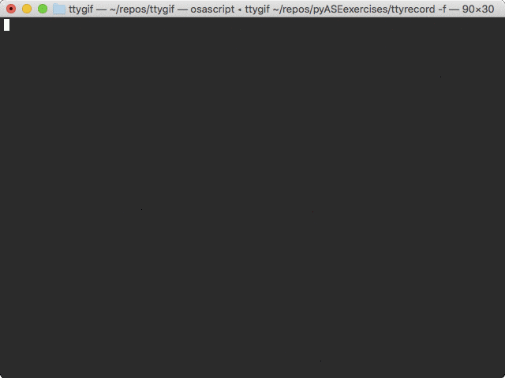

# Exercise 3

_Goal:_ Create an HTTP GET request to /data. Deserialize the response JSON into a Python data type, manipulate the data.

## Deserialization

Like [Exercise 1](./pyExercise1.md), make an HTTP GET request to our [webserver](http://ec2-54-191-220-106.us-west-2.compute.amazonaws.com) -- this time to "[/data](http://ec2-54-191-220-106.us-west-2.compute.amazonaws.com/data)". The response will contain all POST payloads made by your peers in [Exercise 2](./pyExercise2.md) in a JSON array. A JSON array value must be of type string, number, object, array, boolean or _null_. This response will be a JSON array of JSON objects. 

| Python           | JSON   |
|------------------|--------|
| dict	           | object |
| list, tuple	   | array  |
| str	           | string |
| int, long, float | number |
| True	           | true   |
| False	           | false  |
| None	           | null   |

Based on the chart of Python data types to JSON data types, the deserialized response should yield a Python list of dictionaries.


## Data Manipulation

There are several ways to search a list of dictionaries in Python. Here is a common function for the task using a [list comprehension](https://docs.python.org/3/tutorial/datastructures.html#list-comprehensions).

```python
def search_dictionaries(key, value, list_of_dictionaries):
    return [element for element in list_of_dictionaries if element[key] == value]
```


<details><summary>Additional Explanation</summary>
<p>

The list comprehension syntax is:
```
[ expression for element in list if conditional ]
```
This is equivalent to:
```
for element in list:
    if conditional:
        expression
```
      
</p>
</details>


## Putting it together 

Now write your script for the exercise.
* send a GET request to "/data"
* deserialize the response into a Python Object
* find the _message_ from your POST or one of your peers' POSTs based on the _name_ value.

<details><summary>Interactive Solution</summary>
<p>



_Note:_ A Python list is returned. This list will only have one element in this exercise as the DB index enforces unique values for "_name_".  
</p>
</details>